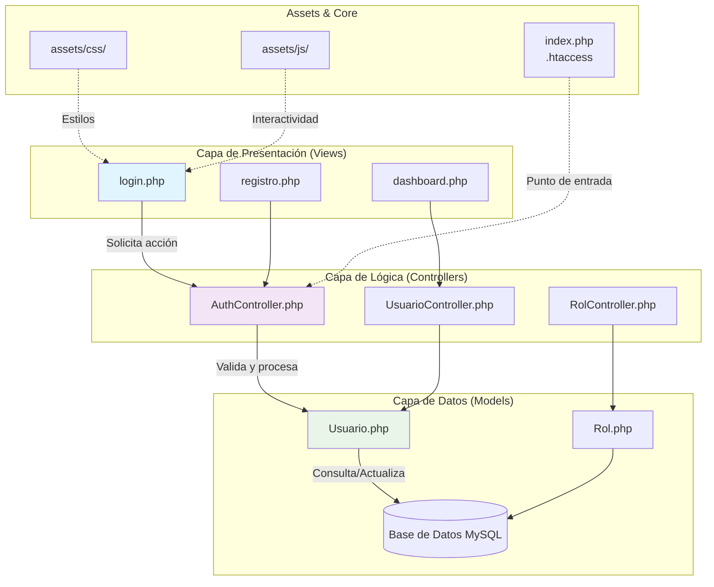
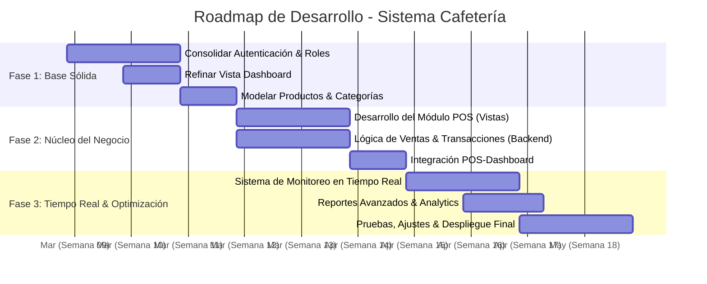

# Diagramas del Proyecto - Sistema de Cafetería

## 1. Arquitectura del Sistema Actual (MVC en PHP)

```mermaid
graph TD
    subgraph "Capa de Presentación (Views)"
        V_Login[login.php]
        V_Dash[dashboard.php]
        V_Reg[registro.php]
    end

    subgraph "Capa de Lógica (Controllers)"
        C_Auth[AuthController.php]
        C_User[UsuarioController.php]
        C_Rol[RolController.php]
    end

    subgraph "Capa de Datos (Models)"
        M_User[Usuario.php]
        M_Rol[Rol.php]
        M_DB[(Base de Datos MySQL)]
    end

    subgraph "Assets & Core"
        A_CSS[assets/css/]
        A_JS[assets/js/]
        Core[index.php<br>.htaccess]
    end

    V_Login -->|Solicita acción| C_Auth
    V_Dash --> C_User
    V_Reg --> C_Auth
    
    C_Auth -->|Valida y procesa| M_User
    C_User --> M_User
    C_Rol --> M_Rol
    
    M_User -->|Consulta/Actualiza| M_DB
    M_Rol --> M_DB
    
    A_CSS -.->|Estilos| V_Login
    A_JS -.->|Interactividad| V_Login
    Core -.->|Punto de entrada| C_Auth

    style V_Login fill:#e1f5fe
    style C_Auth fill:#f3e5f5
    style M_User fill:#e8f5e8
```

## 2. Roadmap de Desarrollo (Diagrama de Gantt)

```mermaid
gantt
    title Roadmap de Desarrollo - Sistema Cafetería
    dateFormat  YYYY-MM-DD
    axisFormat  %b (Semana %U)
    
    section Fase 1: Base Sólida
    Consolidar Autenticación & Roles :2025-03-01, 14d
    Refinar Vista Dashboard         :2025-03-08, 7d
    Modelar Productos & Categorías  :2025-03-15, 7d
    
    section Fase 2: Núcleo del Negocio
    Desarrollo del Módulo POS (Vistas)      :2025-03-22, 14d
    Lógica de Ventas & Transacciones (Backend) :2025-03-22, 14d
    Integración POS-Dashboard               :2025-04-05, 7d
    
    section Fase 3: Tiempo Real & Optimización
    Sistema de Monitoreo en Tiempo Real :2025-04-12, 14d
    Reportes Avanzados & Analytics      :2025-04-19, 10d
    Pruebas, Ajustes & Despliegue Final :2025-04-26, 14d
```